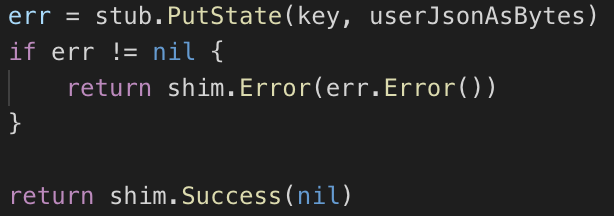
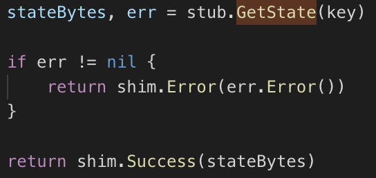
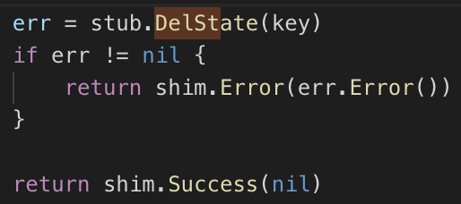

# 4. **chaincode 가이드**

## **chaincode는 shim package를 이용하여 state에 접근**
https://godoc.org/github.com/hyperledger/fabric/core/chaincode/shim
   

## **chaincode의 종류**
- CSCC : Configuration System Chaincode 
- LSCC : Life Cycle System Chaincode 
- QSCC : Query System Chaincode  
- ESCC : Endorser System Chaincode  
- VSCC : Validator System Chaincode 
  

## **chaincode 내 주요 API**
- func Init :  Instantiate/Upgrade 수행시 호출 
- func main : Golang의 시작점 
- func Invoke : function을 호출하기 위한 상위 function 
  

## **shim package 주요 API**
- PutState : 저장

  
- GetState : 조회

  
- DelState : 삭제

  
## **chaincode를 테스트 하는 방법**

1. 테스트 코드 작성하기
2. 실제 네트워크에 올려서 테스트