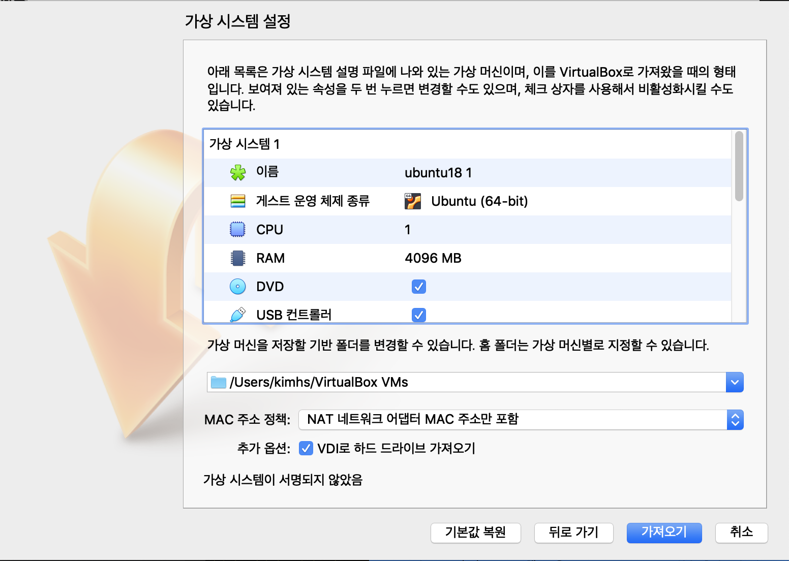
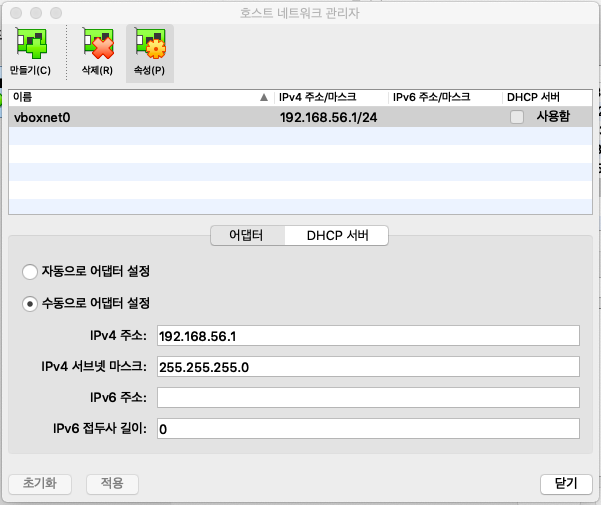
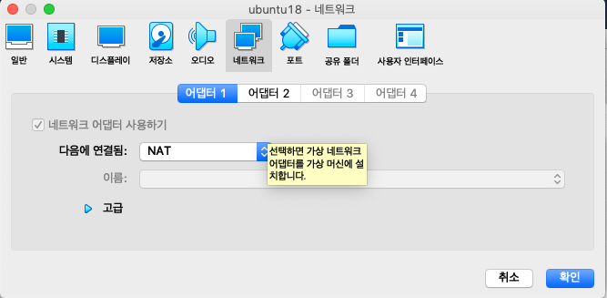
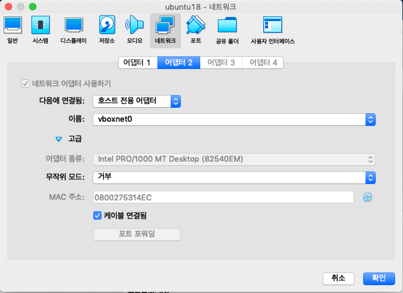

# IBK Blockchain HandsOn 1일차

## **교육 일정**
| 내용 | 시간 | 비고 |
|:--------:|:--------:|:--------:|
| 환경 세팅 | 09:00 ~ 09:50 | 서버 : virtualbox/ubuntu, PC : vscode, golang |
| BreakTime | 09:50 ~ 10:00 ||
| golang 실습 | 10:00 ~ 10:50 | golang 설치 및 기본 기능 소개 |
| BreakTime | 10:50 ~ 11:00 ||
| 체인코드 개발/테스트 | 11:00 ~ 11:50 | golang/test code 작성 |
| Lunch Time | 12:30 ~ 14:00 ||
| fabric network 구성 | 14:00 ~ 14:50 | script |
| BreakTime | 14:50 ~ 15:00 ||
| fabric network 구성 | 15:00 ~ 15:50 | vscode |
| BreakTime | 15:50 ~ 16:00 ||
<br><br>

## **개발 환경/도구 소개**

**개발 환경**
<br/>
1. Linux Ubuntu 18.04.2 LTS
2. JDK v1.8
3. MySQL or MariaDB
4. Docker 17.06.2-ce or greater
5. HyperLedger Fabric v1.4


**개발 도구**<br/>
1. Virtual Box 6.0
2. (Primary)Visual Studio Code
3. (Option)Intellij Community
4. (Option)Eclipse Neon or later(like SpringBoot/Java IDE)
5. putty(windows) / iterm2(mac)
6. chrome
<br/><br/><br/><br/>

<hr>


### **[사전에 준비된 linux(ova)을 다운받아주세요]**
https://drive.google.com/file/d/13MGMJr56nMUQM--cSdTQziwt6UAugAja/view?usp=sharing
<br><br>

## **1. 환경 세팅(Desktop)**

### **1. virtualbox(Desktop)**
1. https://www.virtualbox.org/wiki/Downloads 접속 후 OS에 맞는 SW 다운로드/설치
2. Virtual Box 실행
3. 메뉴 > 파일 > 가상시스템가져오기
4. ubuntu18.ova 파일 선택
5. 아래와 같이 설정
---

---

6. 메뉴 > 파일 > 호스트 네트워크 관리자 > 만들기

---

---
7. 메인 > Linux 이미지 클릭 >  네트워크 > 호스트 전용 어댑터 클릭
8. Linux 이미지 클릭 > 설정 > 네트워크 > 어댑터 1 > NAT 클릭
---

---
9. Linux 이미지 클릭 > 설정 > 네트워크 > 어댑터 2 > HOST전용어댑터 클릭
---

---

10. Linux 접속
11. network 설정


```
$) sudo vi /etc/network/interfaces

auto lo
iface lo inet loopback

auto enp0s8 #host only adap
iface enp0s8 inet static
address 192.168.56.10
netmask 255.255.255.0

$) sudo systemctl restart network
```
<br><br>
### **2. putty 설치(Desktop)**
- 용도 : 서버 접속
1. https://www.chiark.greenend.org.uk/~sgtatham/putty/latest.html 접속
2. putty.exe 다운로드 설치
<br><br>

### **3. golang 설치(Desktop)**
- 용도 : chaincode 개발
1. https://golang.org/dl/ 접속
2. go.1.12.5.window-amd64.msi 다운로드
3. install
<br><br>

### **4. vscode 설치(Desktop)**
- 용도 : chaincode/springboot 개발
1. https://code.visualstudio.com/download 접속
2. OS 버전에 맞는 vscode 설치
3. Extension 설치
>- SpringBoot Tools
>- Spring Initializr
>- SpringBoot Dashboard
>- Java
>- Language Support Java RedHat
>- lombok
>- Log File Highlighter
>- ThymeLeaf

<br><br>

### **5. JDK v1.8 설치(Desktop)**
- 용도 : springboot 개발
1. https://www.oracle.com/technetwork/java/javase/downloads/jdk8-downloads-2133151.html 접속 후 다운로드
1. (optional)https://drive.google.com/open?id=1G_fotm0jlRz-6I0fcMDXsy04W5rw_PlQ 에서 다운로드
2. OS 버전에 맞는 JDK 설치
<br><br>


### **6. maven 설치(Desktop)**
- 용도 : springboot 빌드
> https://www.baeldung.com/install-maven-on-windows-linux-mac 참조
1. http://maven.apache.org/ 접속 후 다운로드 설치
2. 환경 변수 추가(아래 참조)<br>

[Window]<br>
>시스템 환경변수에 maven path 추가<br>
ex)Downloads\apache-maven-버전\bin<br>

[mac]<br>
>$) mv Downloads/apache-maven* /opt/apache-maven<br>
$) nano $HOME/.bashrc<br>
$) export PATH=$PATH:/opt/apache-maven-버전/bin

<br><br><br><br>

## **2. 환경 세팅(linux)**
### **1. docker 설치(linux)**
- 용도 : fabirc network 구축
>https://docs.docker.com/install/linux/docker-ce/ubuntu/ 참조
```
$) sudo apt-get update
$) sudo apt-get install \
    apt-transport-https \
    ca-certificates \
    curl \
    gnupg-agent \
    software-properties-common
$) curl -fsSL https://download.docker.com/linux/ubuntu/gpg | sudo apt-key add -
$) sudo apt-key fingerprint 0EBFCD88
$) sudo add-apt-repository \
   "deb [arch=amd64] https://download.docker.com/linux/ubuntu \
   $(lsb_release -cs) \
   stable"
   //repository 추가
$) sudo apt-get update
$) sudo apt-get install docker-ce containerd.io
$) sudo docker ps
$) sudo docker run hello-world
```


## 3. chaincode 개발

## 4. fabric network 구성


- chaincode는 shim package를 이용하여 state에 접근합니다.
https://godoc.org/github.com/hyperledger/fabric/core/chaincode/shim
<br><br><br>

## chaincode의 종류
- CSCC : Configuration System Chaincode<br>
- LSCC : Life Cycle System Chaincode<br>
- QSCC : Query System Chaincode<br> 
- ESCC : Endorser System Chaincode <br>
- VSCC : Validator System Chaincode<br>
<br><br>


## chaincode 내 주요 API
- func Init :  Instantiate/Upgrade 수행시 호출<br>
- func main : Golang의 시작점<br>
- func Invoke : function을 호출하기 위한 상위 function<br>
<br><br>

## shim package 주요 API
- PutState : 저장
- GetState : 조회
- DelState : 삭제