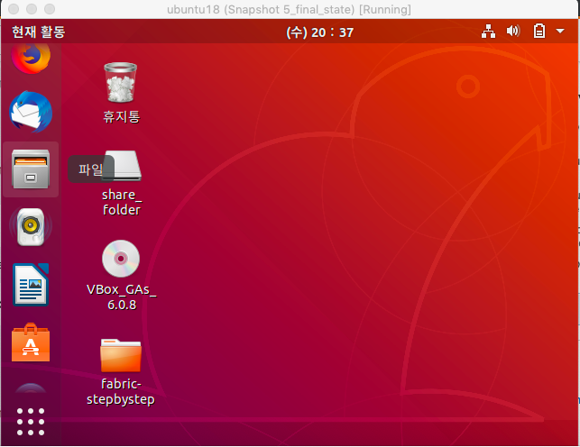
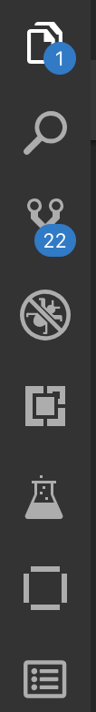
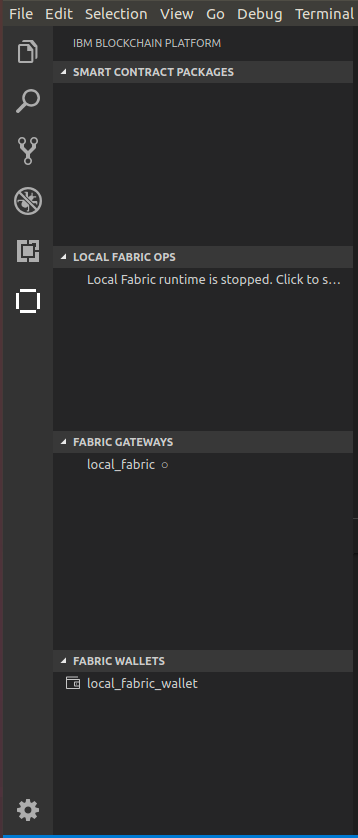

# **2. IBP with vscode**
https://github.com/IBM-Blockchain/blockchain-vscode-extension/blob/master/README.md 참조

## **요구조건**
- Windows 10, Linux, or Mac OS are currently the supported operating systems.
- [VS Code version 1.32 or greater](https://code.visualstudio.com)
- [Node v8.x or greater and npm v5.x or greater](https://nodejs.org/en/download/)
- [Docker version v17.06.2-ce or greater](https://www.docker.com/get-docker)
- [Docker Compose v1.14.0 or greater](https://docs.docker.com/compose/install/)
- [Go version v1.12 or greater for developing Go contracts](https://golang.org/dl/)

### **요구조건(+윈도우 사용자 only)**
- Docker for Windows is configured to use Linux containers (this is the default)
- You have installed the C++ Build Tools for Windows from [windows-build-tools](https://github.com/felixrieseberg/windows-build-tools#windows-build-tools)
- You have installed OpenSSL v1.0.2 from [Win32 OpenSSL](http://slproweb.com/products/Win32OpenSSL.html)
  - Install the normal version, not the version marked as "light"
  - Install the Win32 version into `C:\OpenSSL-Win32` on 32-bit systems
  - Install the Win64 version into `C:\OpenSSL-Win64` on 64-bit systems
    

## **1. golang 설치**
- 용도 : chaincode 빌드 

1. **Linux 접속** 
curl -O https://dl.google.com/go/go1.12.5.linux-amd64.tar.gz

2. **압축풀기** 
tar -xvzf go1.12.5.linux-amd64.tar.gz

3. **폴더 옮기기** 
mv go /usr/local/

4. **GOPATH 설정하기** 
sudo  vi ~/.bash_profile 
export PATH=$PATH:/usr/local/go/bin

5. **go 설치 확인하기** 
sudo go version
       

## **2. vscode 설치**
1. virtualBox를 이용해 Linux 접속

2. 우분투 소프트웨어 선택
 

3. vscode 검색 후 설치
 

4. vscode extension 검색 
5. ibm blockchain platform 검색 및 설치
      

## **3. IBP 이용해보기(new chaincode)**
1. $GOPATH/src/폴더 하나 만들기(ex>ibkchaincode)

2. IBP 아이콘 클릭 
 

3. IBP 메인화면 진입
- Smart Contract Packages
: Smart Contract 생성/패키지/import 
- Local Fabric Ops
: SmartContract, Channels, Nodes, Organizations 표현
- Fabric Gateways
: 현재 연결된 network, 사용자 ID, 채널명

- Fabric Wallets
: 관리자 신원 인증(admin)이 포함되어 있음
 

4. Smart Contract Packages 메뉴 클릭
5. Create Smart Contract Project 클릭
6. Go language 클릭
7. Browser에서 1번에서 만든 폴더 클릭

8. fabric opt 실행 click to start 
 : local fabric runtime이 구동되며
1조직, 1피어 1채널로 구성된 네트워크가 만들어짐. 이것을 클릭하면 처음 시작되면 fabric 이미지가 자동으로 설치됨(만약 설치가 안되어 있다면) 그리고 네트워크가 구동됨

9. package a smart contract project 클릭 
: $GOPATH/src/이곳에 있어야함
만약 chaincode가 있다면 import도 가능함

5. install smartcontract 해보기  
6. instantiate smarcontract 해보기 
7. invoke 해보기
8. query 해보기
   

## **4. IBP 이용해보기(기존에 만든 chaincode를 사용하는 경우)**
1. $GOPATH/src/ 여기로 작성한 체인코드 폴더 이동 
3. IBP 아이콘 클릭 
4. vscode workspace에 추가 
5. package a smart contract project 클릭 
6. install smartcontract 해보기  
7. instantiate smarcontract 해보기 
8. invoke 해보기 
9. query 해보기 